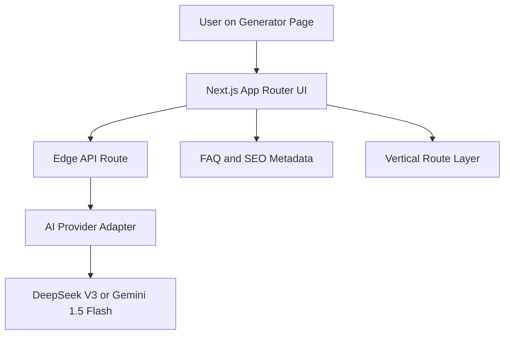

# TikTok Hook Master AI

Feature Name: 2026-05-03-tiktok-hook-master-ai
Updated: 2026-05-03

## Description

本设计面向一个全新的海外短视频文案生成站点。仓库当前未发现现成的 Next.js、前端页面或历史规格，因此本方案按 greenfield 项目处理，目标是用 Next.js App Router、Tailwind CSS 和 Vercel Edge Route 实现一个移动端优先、暗黑霓虹视觉风格的 hook 生成器，并为未来 `/generator/[vertical]` 扩展保留统一的页面骨架与元数据生成能力。

## Architecture



架构分为四层：

1. 页面层：负责输入表单、结果列表、手机预览、FAQ 和 SEO 元数据。
2. 交互层：负责表单校验、生成态、单卡片复制与单卡片重生成。
3. 服务层：通过 Edge API Route 组装 prompt、调用模型、校验返回格式。
4. 扩展层：通过 `/generator/[vertical]` 路由对垂类内容、标题和 metadata 进行参数化。

## Components and Interfaces

### 1. App Routes

- `app/page.tsx`
  - 根首页，可作为营销入口并导向生成器，或直接承载默认生成器。
- `app/generator/page.tsx`
  - 通用生成器页面，使用默认 TikTok hook 文案和 metadata。
- `app/generator/[vertical]/page.tsx`
  - 垂类生成器页面，例如 `fitness`、`gaming`。
- `app/api/generate-hooks/route.ts`
  - Edge Runtime API，处理整批 hooks 生成。
- `app/api/regenerate-hook/route.ts`
  - Edge Runtime API，处理单条 hook 替换。

### 2. UI Components

- `HookGeneratorForm`
  - 职责：收集 `topic`、`audience`、`tone`、`trendTemplate`。
  - 行为：客户端校验、提交、禁用态和 Lottie generating 动画切换。
- `HookResultsList`
  - 职责：渲染 5 到 10 条结果，管理局部重生成状态。
- `HookCard`
  - 职责：展示 hook、category、copy 按钮、regenerate 按钮、手机预览。
- `PhonePreviewMock`
  - 职责：模拟 TikTok 手机框与字幕展示区域。
- `FaqSection`
  - 职责：输出 AEO 友好的 `How it works` 和 `Why hooks matter` 内容块。
- `GradientButton`
  - 职责：封装主 CTA 和次级 CTA 的视觉一致性。

### 3. Service Interfaces

建议在 `lib/ai/` 下定义统一接口：

```ts
export type HookGenerationInput = {
  topic: string;
  audience: string;
  tone: 'Shocking' | 'Educational' | 'Relatable' | 'Controversial' | 'Storytime';
  trendTemplate?: '#POV' | '#LifeHack' | '#UnpopularOpinion';
  vertical?: string;
  count?: number;
};

export type GeneratedHook = {
  text: string;
  category: string;
};

export interface HookAiProvider {
  generateHooks(input: HookGenerationInput): Promise<GeneratedHook[]>;
  regenerateHook(input: HookGenerationInput & { currentHook?: string; category?: string }): Promise<GeneratedHook>;
}
```

提供两个实现方向：

- `DeepSeekProvider`
- `GeminiFlashProvider`

通过环境变量选择主 provider，避免页面层直接感知模型差异。

## Data Models

### Form Model

```ts
type HookFormState = {
  topic: string;
  audience: string;
  tone: 'Shocking' | 'Educational' | 'Relatable' | 'Controversial' | 'Storytime';
  trendTemplate?: '#POV' | '#LifeHack' | '#UnpopularOpinion';
};
```

### Result Model

```ts
type HookResult = {
  id: string;
  text: string;
  category: string;
  previewCaption: string;
  isRegenerating: boolean;
};
```

### Metadata Model

```ts
type GeneratorMetadata = {
  title: string;
  description: string;
  vertical?: string;
  canonicalPath: string;
};
```

## Correctness Properties

1. 每次成功生成必须返回 5 到 10 条可展示结果，或明确返回可恢复错误。
2. 每条结果都必须带有 `text` 和 `category`，缺一不可。
3. 每条 `text` 必须在展示前经过长度和空值校验，目标上限为 15 个英文单词。
4. 单条重生成只能替换目标卡片，不能覆盖整组结果。
5. 表单提交时必须保证 `topic` 与 `audience` 已提供。
6. 垂类页面必须复用同一套生成逻辑，避免行为分叉。
7. 所有 AI provider 凭据都必须来自环境变量。

## Error Handling

### Client Errors

- 缺少 `topic`：在 Topic 输入框附近展示内联校验文案。
- 缺少 `audience`：在 Audience 输入框附近展示内联校验文案。
- 剪贴板复制失败：提供轻量 toast，提示用户手动复制。

### Server Errors

- AI provider 超时：返回统一错误码和用户可理解提示，例如 `Generation took too long. Please try again.`
- AI provider 返回空列表：服务端执行一次结果归一化检查，失败则返回可恢复错误。
- AI provider 返回格式异常：服务端过滤无效项；若有效项不足 5 条，则整体判定为失败。
- 环境变量缺失：API 在服务端记录错误，并向客户端返回非敏感通用错误。

## Prompting Strategy

系统提示词应保留你给出的核心定位，并补充输出格式约束。建议逻辑如下：

```text
You are a world-class TikTok viral consultant.
Based on the Topic and Audience provided, generate 5 to 10 hooks that leverage psychological triggers like loss aversion, curiosity, or social proof.
Each hook must be in English, under 15 words, punchy, and ready for TikTok, Reels, or Shorts.
Return JSON only.
Each item must include: text, category.
```

用户输入部分拼接：

- Topic
- Audience
- Tone
- Trend Template
- Vertical context when present

## SEO and AEO Design

1. 通过 Next.js `generateMetadata` 为 `/generator` 与 `/generator/[vertical]` 自动生成标题和描述。
2. FAQ 区块采用静态可索引内容，不依赖用户交互后才渲染。
3. 页面主体保留清晰 H1、H2、说明段落和 FAQ 标题，利于搜索引擎与答案引擎抽取。
4. 垂类页面可根据 `vertical` 注入差异化标题，例如 `TikTok Fitness Hook Generator`。
5. 后续如需要扩展 Programmatic SEO，可在垂类配置中增加 intro、faq、keywords、examples。

## UI Implementation Notes

1. 使用 Tailwind CSS 实现暗色背景、霓虹渐变边框和玻璃拟态卡片。
2. 主按钮使用 `from-pink-500 to-cyan-500` 渐变，并保留 hover 与 disabled 状态。
3. Lottie 动画仅用于 generating 态，失败或成功后立即切回静态按钮内容。
4. 结果区在移动端采用单列卡片，在较宽视口可扩展为双列，但手机预览仍需保持可读。
5. 若项目使用 Vite 或其他 dev server 时需要开放预览域名，应补充 `allowedHosts` 配置；当前方案默认基于 Next.js。

## Test Strategy

### Unit Tests

- 表单校验函数：验证 `topic`、`audience`、默认 tone 行为。
- AI 结果归一化函数：过滤空值、超长文本和缺失 category 项。
- metadata 生成函数：验证默认页与垂类页输出。

### Component Tests

- `HookGeneratorForm` 提交态与 loading 态。
- `HookCard` 复制成功反馈与单卡片重生成按钮状态。
- `FaqSection` 是否渲染目标问题和答案块。

### Integration Tests

- 从表单提交到结果渲染的成功链路。
- AI provider 失败时的 UI 错误提示。
- `/generator/[vertical]` 页面加载默认占位与 metadata 输出。

### Manual Verification

1. 在移动端宽度下检查输入区、按钮和结果卡片是否完整可用。
2. 在桌面端检查布局扩展后是否仍保持主 CTA 突出。
3. 检查复制、整批生成、单项重生成是否互不冲突。
4. 检查部署到 Vercel 后 Edge API 是否能正确读取环境变量。

## References

[^1]: (Filename) - `.monkeycode/specs/2026-05-03-tiktok-hook-master-ai/requirements.md`
